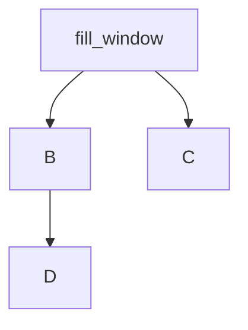

# cs144 lab实现思路

**目录** 

[TOC]

## lab1

### 题目理解

TCP接受方缓存大小有限的条件下，到达的数据片段可以出现乱序、冗余、超过缓存大小等情况，实现将这些片段拼接为完整的数据。

值得注意的点：

- 在缓存中的所有数据只要可以拼接起来就要立即交付给stream（对应TCP的上层应用）
- eof的标志为：收到了_eof标志并且缓存区中没有需要拼接的数据（对应TCP回话结束）

### 实现思路

利用内置的 SET 容器，将数据段按照对应的 index 排列起来，方便后续数据段之间的合并。

整个思路为：

1. 维护一个 low_index 标记已经收到并推到 stream 中的数据位置
2. 每进入一个新的数据片段，通过其数据长度和起始 index 判断该数据片段是否有新的数据信息
3. 如果数据段有新的数据信息，那么将该数据与缓冲中的所有数据段合并，并且在合并的同时，考虑和计算缓存中未推送到 stream 中的数据量
4. 判断缓存中的数据是否可以推到 stream 中，如果可以则立即推出
5. 如果收到 eof 标志，则判断是否有数据没有推到 stream，在决定是否结束 stream 输入

## lab2

### 题目理解

TCP receiver 实现

### 实现思路

在没收到 SYN 和 ISN 之前，接收到的所有数据包都应该扔掉，即首先需要建立 TCP 连接，在接收到 SYN 标志的数据包，获得 ISN 之后，才可以接受数据包，并且在已有获得过 ISN 数据包的情况下，   再次获得 SYN数据包应丢弃，但对应实际的 TCP 连接而言，需要判断是否是同一个客户端的连接请求，不能直接丢弃，本实验中，猜想为了实现简单，采取直接丢弃的方式才可以全部通过测试样例。

#### 需要注意的点

- 对于 ackno 而言，在计算时需要计入 SYN 和 FIN 占位，即各自都要占一个 index 位置
- 每个 TCP 连接中仅可以收到一个 SYN 标志和一个 FIN，故在实现中的思路也只考虑了这种情况
- 在收到 FIN 标志的数据包时，并不意味着数据发送结束，因为前面的报文段可能丢失，需要 stream input ended 的状态才 and 已经收到带有 FIN 标志的数据包之后才是发送数据结束

### 题目总结

本次 lab 相对来说比较简单，只要考虑好 TCP 连接过程中接受方收到包的逻辑思路即可。

## lab3

### 题目理解

TCP sender 实现

逻辑整理：

**fill window**

